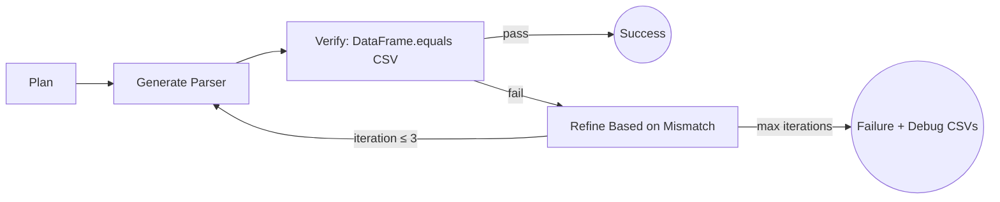
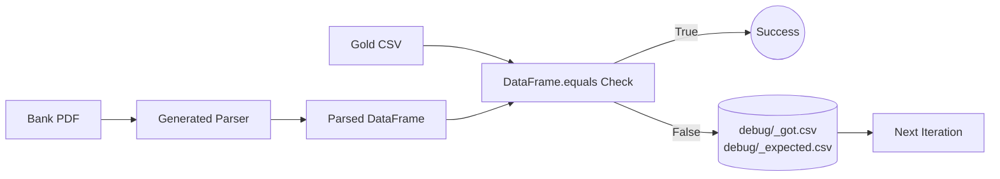
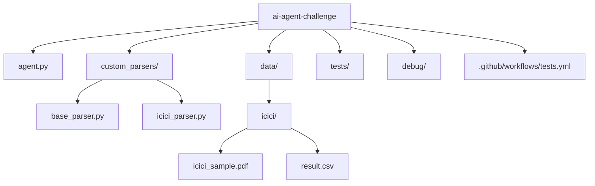

# AI Agent Challenge - Bank Statement Parser Generator

[](https://github.com/rushibommu-svg/ai-agent-challenge/actions/workflows/tests.yml)
[](#)
[](LICENSE)

## Overview

An AI-powered coding agent that automatically generates custom parsers for bank statement PDFs.  
The agent succeeds only when the parsed DataFrame **strictly equals** the expected CSV via `DataFrame.equals()` — no approximations, no manual adjustments.

**Key strengths**: Verifier-first loop architecture, intelligent table→line parsing fallback, Unicode/locale safety, and comprehensive debug artifacts for transparency.

---

## Why This Beats "Naive LLM Invoke"

Traditional approaches fail in production due to:

- **Determinism & Reproducibility**: Strict equality checks and seeded runs, not subjective "looks good" validation  
- **Verification-gated Loop**: Each iteration is validated against ground truth, not "LLM confidence"  
- **Fallback Parsing Strategy**: pdfplumber for tables, pypdf fallback for line-mode parsing  
- **Unicode/Locale Robustness**: NFKC normalization + locale-aware parsing for decimals/dates  
- **Clear Pass/Fail Criteria**: Debug CSVs (`debug/<bank>_got.csv` vs `debug/<bank>_expected.csv`) enable instant failure diagnosis  

---

## Quick Start

**Prerequisites**: Python 3.11+

### Setup Environment

```bash
# macOS/Linux
python -m venv .venv && source .venv/bin/activate
pip install -r requirements.txt

# Windows (PowerShell)
python -m venv .venv
.venv\Scripts\Activate.ps1
pip install -r requirements.txt
```

### Run the Agent

```bash
python agent.py --target icici --max-iters 1 --quiet
```

### Run Tests

```bash
pytest -q
```

### Coverage (Terminal)

```bash
pytest --cov=agent --cov=custom_parsers --cov-report=term-missing -q
```

### Coverage (HTML)

```bash
pytest --cov=agent --cov=custom_parsers --cov-report=html -q
# open htmlcov/index.html in your browser
```

---

## Repository Layout

```
├── agent.py                           # Main agent entrypoint
├── custom_parsers/                    # Generated parsers directory
│   ├── __init__.py
│   ├── base_parser.py                 # Parser base class
│   └── icici_parser.py                # Generated ICICI parser
├── data/                              # Bank statement samples + gold CSVs
│   └── icici/
│       ├── icici_sample.pdf
│       └── result.csv
├── tests/                             # Comprehensive test suite
├── debug/                             # Debug artifacts on mismatch
├── requirements.txt                   # Core dependencies
├── requirements-dev.txt               # Development dependencies
└── .github/workflows/tests.yml        # CI/CD pipeline
```

---

## Design & Implementation Highlights

* **Agentic Loop (≤3 iterations)**: Plan → Generate → Verify → Refine
* **Strict Equality Validation**: Success only when `DataFrame.equals(expected_csv)` returns True
* **Dual Parsing Strategy**: pdfplumber table extraction with pypdf line-mode fallback
* **Unicode Safety**: NFKC normalization prevents glyph composition issues
* **Locale Awareness**: Handles regional decimal/thousand separator variations
* **Deterministic Execution**: Seeded where applicable for reproducible results
* **Extensible Architecture**: Adding new banks requires only PDF + CSV placement

---

## Why This Matters

*  Automates tedious **financial data extraction** reliably
*  Handles **edge cases banks introduce** (locale quirks, Unicode, schema shifts)
*  Easily extensible to other structured PDFs (invoices, bills, forms)

---

## Test Strategy & Coverage (~90%)

Our test suite covers:

* **End-to-end agent execution**: Full workflow from PDF to validated parser
* **Parser generation + fallback**: Table extraction failure → line-mode recovery
* **Strict equality validation**: DataFrame vs CSV comparison with debug artifacts
* **Refinement loops**: Self-fix behavior within iteration limits
* **Error path handling**: Graceful failures + informative errors
* **Helper utilities**: Unicode normalization, locale handling, file I/O

**Current coverage**: ~90% across agent core and parser modules.
*29 tests ensure both success and failure paths are covered — no silent errors slip through.*

```bash
# Verify coverage matches our results
pytest --cov=agent --cov=custom_parsers --cov-report=term-missing -q
```

---

## Thought Process & Architecture (Verifier-First)

Traditional LLM workflows rely on subjective validation ("does this look right?").
Our **verifier-first** approach gates every step on objective truth:

1. **Objective Success Criteria**: `DataFrame.equals()` — binary pass/fail
2. **Small, Deterministic Refinements**: Each iteration makes targeted fixes based on mismatches
3. **Early Termination**: Stop immediately on success, avoiding over-engineering
4. **Debug Transparency**: Failures produce `debug/<bank>_got.csv` for inspection

---

## Normalization & Semantics

Our parser handles complex real-world banking data through sophisticated normalization:

* **Unicode Normalization (NFKC)**: Ensures consistent symbol representation across different PDF encodings
* **Multi-Locale Amount Formats**: Supports Indian (`1,23,456.78`), US (`1,234.56`), and European (`1.234,56`) number formats
* **Currency Symbol Stripping**: Handles `₹`, `$`, `£`, `€`, and apostrophes
* **Parentheses Convention**: `(500)` → `-500` for negative amounts
* **DR/CR Semantics (Case-Sensitive)**:
  * `DR` → debit (negative amount)
  * `CR` → credit (positive amount)
  * lowercase `dr`/`cr` treated as neutral text (ignored)
* **Date Coercion**: Flexible input patterns converted to expected CSV format consistently

---

## Diagrams

### Agentic Loop Flow



### Data Flow & Validation



### Repository Structure



---

## Add a New Bank (Step-by-Step)

1. **Place Files**: Add `data/<bank>/<bank>_sample.pdf` and `data/<bank>/result.csv`
2. **Run Agent**: `python agent.py --target <bank> --max-iters 1 --quiet`
3. **Verify Generation**: Agent writes `custom_parsers/<bank>_parser.py`
4. **Test Coverage**: `pytest --cov=agent --cov=custom_parsers --cov-report=term-missing -q`
5. **Success Confirmation**: Green tests + parser in `custom_parsers/`

---

## Troubleshooting

* **Missing Files Error** → Ensure `data/<bank>/<bank>_sample.pdf` and `data/<bank>/result.csv` exist
* **Windows Path Issues** → Wrap file paths in quotes if containing spaces
* **Unicode/Locale Mismatches** → Check NFKC normalization and consistent separators in CSV
* **Coverage Missing Modules** → Run with both `--cov=agent` and `--cov=custom_parsers`
* **DataFrame Inequality** → Compare `debug/<bank>_got.csv` vs `debug/<bank>_expected.csv`

---

## Links

* [Data Directory Documentation](data/README.md)
* [CI/CD Pipeline](.github/workflows/tests.yml)

---
