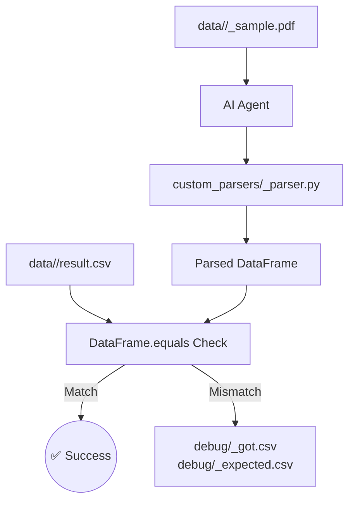

# Data Directory - rushibommu-svg/ai-agent-challenge

## Purpose

The `data/` directory contains bank statement PDF samples and their corresponding ground truth CSV files. The agent reads these files to generate custom parsers that produce DataFrames **strictly equal** to the expected CSV output.

## Structure

```
data/
├── icici/
│   ├── icici_sample.pdf     # Sample ICICI bank statement
│   └── result.csv           # Expected parsing output (ground truth)
└── <another_bank>/
    ├── <another_bank>_sample.pdf
    └── result.csv
```

## File Expectations

### PDF Files
- **Naming Pattern**: `<bank>_sample.pdf` (e.g., `icici_sample.pdf`)
- **Content**: Representative bank statement with typical transaction formats
- **Size**: Keep reasonably small for fast processing and testing

### CSV Files
- **Name**: Always `result.csv` (standardized across all banks)
- **Format**: Expected DataFrame output after parsing the corresponding PDF
- **Schema**: Must match exactly what the generated parser should produce
- **Precision**: Number formats, date formats, and text values must be identical to expected parser output

## Agent Behavior

### Automatic Discovery
When you run:
```bash
python agent.py --target <bank>
```

The agent automatically:
1. Reads `data/<bank>/<bank>_sample.pdf`
2. Loads `data/<bank>/result.csv` as ground truth
3. Generates `custom_parsers/<bank>_parser.py`
4. Validates output using `DataFrame.equals(expected_csv)`

### Debug Artifacts on Mismatch
If the parsed DataFrame doesn't match the expected CSV, the agent writes:
- `debug/<bank>_got.csv` - Actual parser output
- `debug/<bank>_expected.csv` - Copy of ground truth for comparison

This enables precise debugging of formatting, column ordering, or data type mismatches.

## Adding a New Bank

### Step-by-Step Process

1. **Create Bank Directory**:
   ```bash
   mkdir data/<bank_name>
   ```

2. **Add PDF Sample**:
   - Place your bank statement PDF as `data/<bank_name>/<bank_name>_sample.pdf`
   - Ensure it contains representative transactions and formatting

3. **Create Ground Truth CSV**:
   - Manually parse the PDF or use existing tools to create `data/<bank_name>/result.csv`
   - This CSV defines exactly what the agent's parser should produce

4. **Run the Agent**:
   ```bash
   python agent.py --target <bank_name> --max-iters 1 --quiet
   ```

5. **Verify Success**:
   ```bash
   pytest -q  # Should include tests for your new bank
   ```

6. **Check Coverage**:
   ```bash
   pytest --cov=agent --cov=custom_parsers --cov-report=term-missing -q
   ```

### Success Confirmation
- ✅ `custom_parsers/<bank_name>_parser.py` is generated
- ✅ `pytest` shows green tests
- ✅ No debug CSV files created (indicates perfect match)

## Tips for Data Quality

### Number Formats
- Ensure decimal and thousand separators match your locale expectations
- Example: `1,234.56` (US) vs `1.234,56` (European)
- The agent handles Unicode normalization but format consistency is crucial

### Date Formats  
- Use consistent date formatting in your CSV
- Common formats: `YYYY-MM-DD`, `DD/MM/YYYY`, `MM/DD/YYYY`
- Ensure the PDF's date format aligns with CSV expectations

### Text Consistency
- Remove trailing spaces and normalize Unicode characters in CSV
- The agent applies NFKC normalization but starting clean helps

### Representative Samples
- Include various transaction types (debits, credits, fees)
- Cover edge cases like zero amounts, long descriptions, special characters
- Keep PDF samples small but comprehensive

## Data Flow Diagram



---

## Why This Data Design Matters

* **Evaluator usability**: Any evaluator can drop in `<bank>_sample.pdf` + `result.csv`, run the agent, and instantly see if parsing succeeds.
* **Fintech realism**: Bank statements vary by locale, number formats, and date styles — this setup ensures the agent is tested against real-world quirks.
* **JD alignment**: Mirrors how financial AI systems must operate in production: handle diverse inputs, normalize consistently, and validate outputs against ground truth.

---